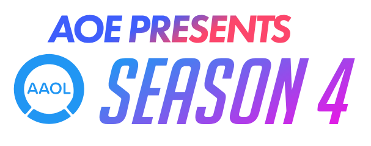

# **AOE**

AOE (Amateur Oceanic Esports) is organising tournaments and community events in Overwatch. Currently running the AAOL and the Rise Up Invitational. AOE also hosts community events on the AOE Discord. [**Contact us.**](./contact)

* * *

## Rise Up Invitational

The Rise Up Invitational is a tournament for teams looking to rise to the top level of competition in Oceania. It features some of the best up and coming talent in the region, who will battle it out over 5 weeks of competition. 8 teams have been invited, and the tournament will begin on August 19th. 

#### Check it out on our Twitch. First match 7PM AEST 19/08/2018:
*   Twitch: https://twitch.tv/AOEsports

* * *

## AAOL

The AAOL is the largest independent Overwatch tournament in Oceania, currently serving over 500 players across 60 teams. The AAOL is open to players of any SR and hosts weekly matches in a relaxed environment, helping players improve their own skills as well as their teamplay. Players can sign up with or without a team - for those without a team, AOE will match them with other individual or non-team signups to create teams, which are supported by their AOE appointed Team Managers. 

The AAOL aims to create a casual competitive environment, in which people can learn, make friends and have the opportunity to play competitively without the headache of solo queue.

AAOL is currently mid-season, while signups are not open at this time, you can join our Discord to become a part of our community (and potentially substitute for teams!) and [check out our weekly matches on our Twitch!](https://twitch.tv/aoesports)

